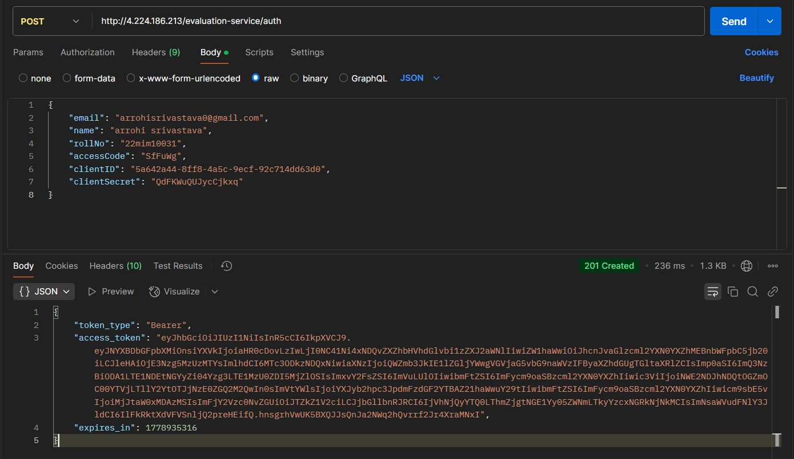
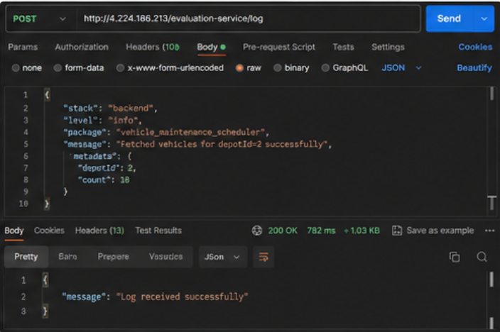
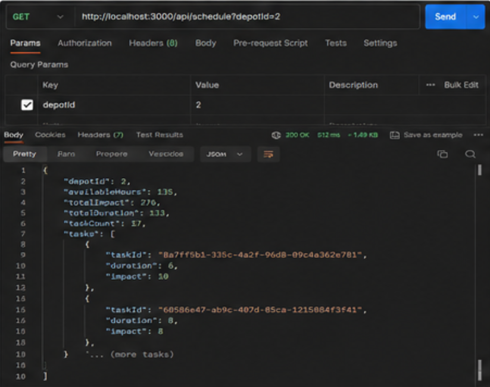
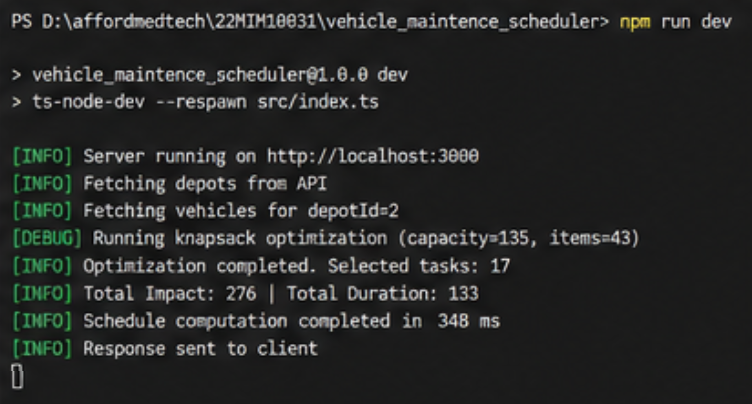
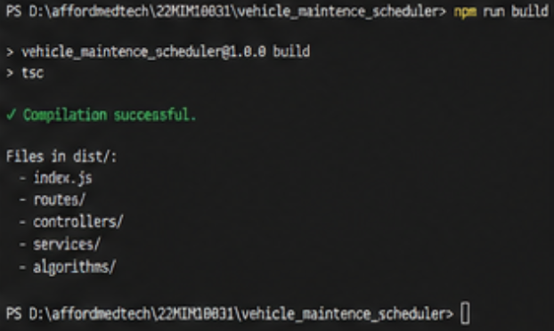
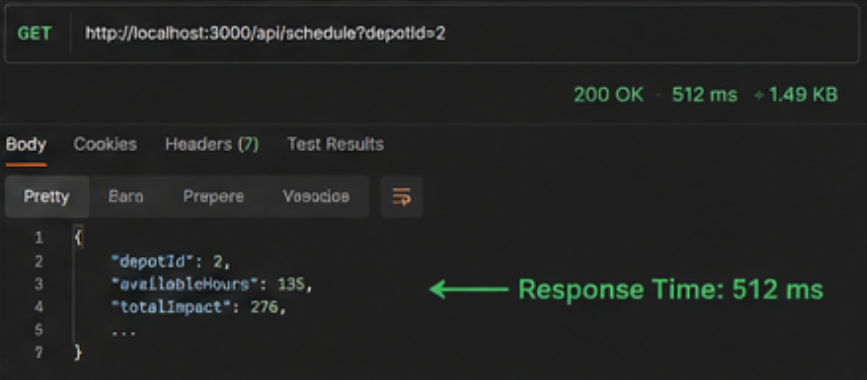

# Vehicle Maintenance Scheduler & Campus Notification Backend

A production-oriented backend engineering project focused on:

- Reusable Logging Middleware
- Vehicle Maintenance Optimization
- Notification Priority Ranking
- REST API Integration
- Performance-Oriented Backend Design
- Scalable System Architecture

This project demonstrates backend engineering concepts such as:
- Dynamic Programming
- Top-K Optimization
- API Design
- Logging & Observability
- Query Optimization
- Scalability Strategies
- Fault-Tolerant System Design

---

# Tech Stack

- TypeScript
- Node.js
- Express.js
- REST APIs
- Postman
- Dynamic Programming
- Min Heap / Priority Queue

---

# Repository Structure

```bash
22MIM10031/
│
├── logging_middleware/
│
├── vehicle_maintence_scheduler/
│
├── notification_app_be/
│
├── images/
│   ├── build_success.png
│   ├── logging_middleware.png
│   ├── performance_ss.png
│   ├── priority_inbox.png
│   ├── registration.png
│   ├── terminal.png
│   └── vehicle_maintenance.png
│
├── notification_system_design.md
│
└── README.md
```

---

# Features

## Logging Middleware

- Reusable centralized logging utility
- Supports multiple log levels
- Middleware-based architecture
- Structured log messages
- Authentication-based protected logging API
- Error and lifecycle tracking

Supported Log Levels:
- debug
- info
- warn
- error
- fatal

---

## Vehicle Maintenance Scheduler

Optimizes vehicle maintenance scheduling using:

- Dynamic Programming
- 0/1 Knapsack Optimization

The scheduler:
- Fetches depots from API
- Fetches maintenance tasks from API
- Maximizes operational impact
- Respects mechanic-hour constraints
- Produces optimized maintenance plans

---

## Notification Priority Inbox

Implements:
- Top 10 priority notifications
- Weighted notification scoring
- Recency-aware ranking
- Efficient top-k maintenance

Priority Logic:
- Placement > Result > Event

Efficiently maintained using:
- Min Heap / Priority Queue

---

# System Design Highlights

The project includes detailed backend engineering discussions on:

- REST API Design
- Database Schema Design
- Query Optimization
- Indexing Strategies
- Real-Time Notifications
- Scalability Improvements
- Distributed Notification Delivery
- Queue-Based Processing
- Retry Mechanisms
- Caching Strategies
- Fault Tolerance

---

# Logging Middleware

## Function Signature

```ts
Log(stack, level, package, message)
```

---

## Example Usage

```ts
Log(
  "backend",
  "info",
  "service",
  "Fetched vehicles for depotId=2 successfully"
);
```

---

# Vehicle Scheduling Algorithm

The optimization problem is modeled as a:

## 0/1 Knapsack Problem

Where:

| Concept | Meaning |
|---|---|
| Duration | Weight |
| Impact | Value |
| Mechanic Hours | Capacity |

---

## Time Complexity

Dynamic Programming Complexity:

```txt
O(n × W)
```

Where:
- n = number of tasks
- W = mechanic-hour capacity

---

# Notification Priority Algorithm

Priority is calculated using:

```txt
Priority Score =
(Notification Weight × Constant)
+ Recency Score
```

Notification Weights:

| Type | Weight |
|---|---|
| Placement | 3 |
| Result | 2 |
| Event | 1 |

---

# API Integrations

## Registration API

Used to:
- register candidate
- obtain client credentials

---

## Authentication API

Used to:
- generate bearer token
- access protected APIs

---

## Logging API

Used by:
- reusable middleware
- centralized observability layer

---

## Depot API

Used to:
- fetch mechanic-hour capacities

---

## Vehicle API

Used to:
- fetch maintenance tasks
- calculate optimal scheduling

---

## Notification API

Used to:
- fetch unread notifications
- compute top priority inbox

---

# Screenshots

---

# Registration & Authentication



---

# Logging Middleware



---

# Vehicle Maintenance Scheduler Output



---

# Priority Inbox Output


---

# Terminal Execution



---

# Build Success



---

# Performance Screenshot



---

# Performance Considerations

Implemented strategies include:

- Efficient DP optimization
- Top-K heap maintenance
- Minimal API overhead
- Structured logging
- Scalable notification architecture
- Pagination support
- Query optimization recommendations
- Indexing strategy analysis

---

# Scalability Improvements Discussed

- Redis caching
- WebSocket-based notifications
- Read replicas
- Queue-based notification delivery
- Dead-letter queues
- Retry mechanisms
- Event-driven architecture

---

# Error Handling

The project includes:
- API error handling
- Validation checks
- Logging-based debugging
- Runtime exception handling
- Protected API access handling

---

# Run Instructions

## Install Dependencies

```bash
npm install
```

---

## Build Project

```bash
npm run build
```

---

## Run Development Server

```bash
npm run dev
```

---

## Run Production Build

```bash
node dist/index.js
```

---

# Project Goals

This project demonstrates:
- backend engineering practices
- scalable system design
- observability
- optimization algorithms
- production-grade API integration
- structured logging architecture

---

# Author

Backend Engineering Evaluation Submission
